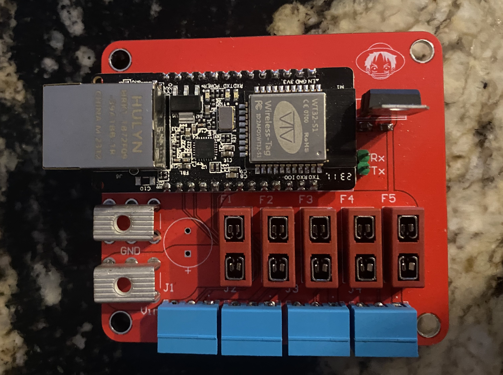
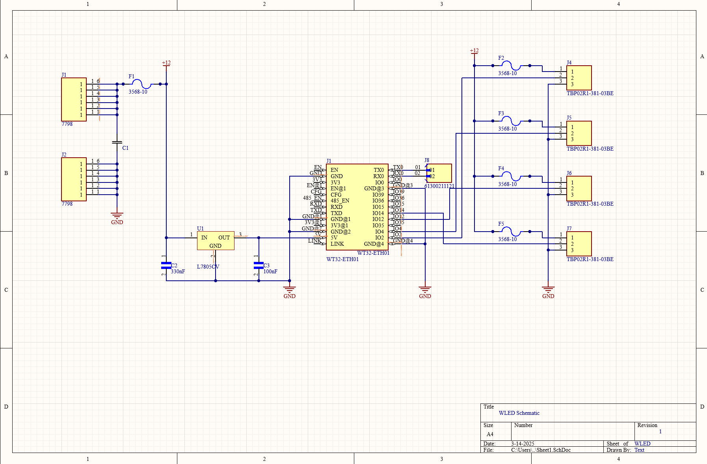
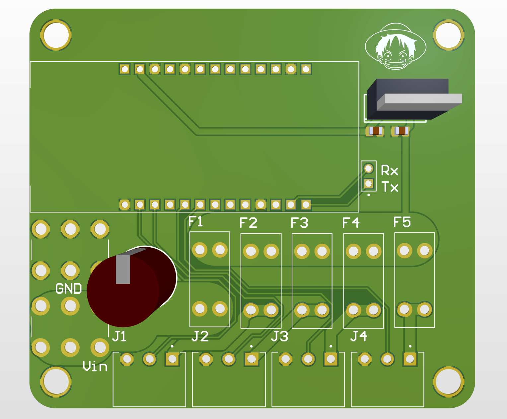

# WLED Controller V1

This device is a WLED controller based on ESP32-ETH01 that is capable of supplying 12-36V to 4 pixel outputs for 5A each up to a total of 20A.
It can be connected to by Ethernet or WIFI.
Typically WIFI Conecction is used when controlled through the WLED UI.
WLED supports Distributed Display Protocol (DDP) which can be sent from a sequance loaded on a Falcon Pi Player (FPP), and is more effective over ethernet as WIFI can introduce latency. 
UART Tx and Rx headers are included for flashing firmware with a UART USB bridge.

This project was designed in Altium, fabricated by JLCPCB, and assembled by hand.

Image of Assembled Device:

Image of Schematic:

Image of Model:

